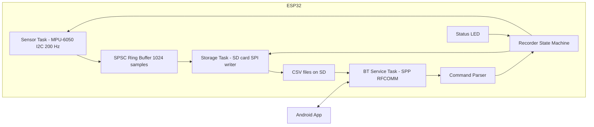
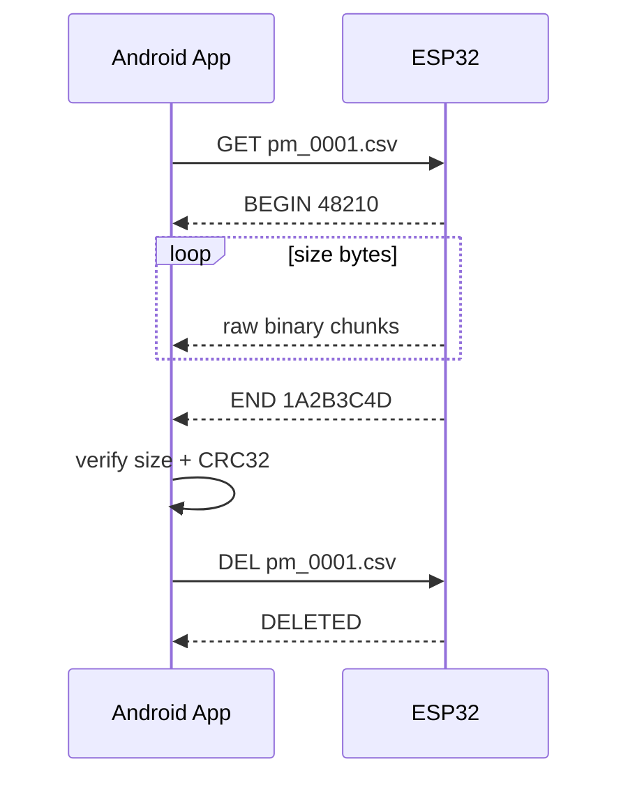
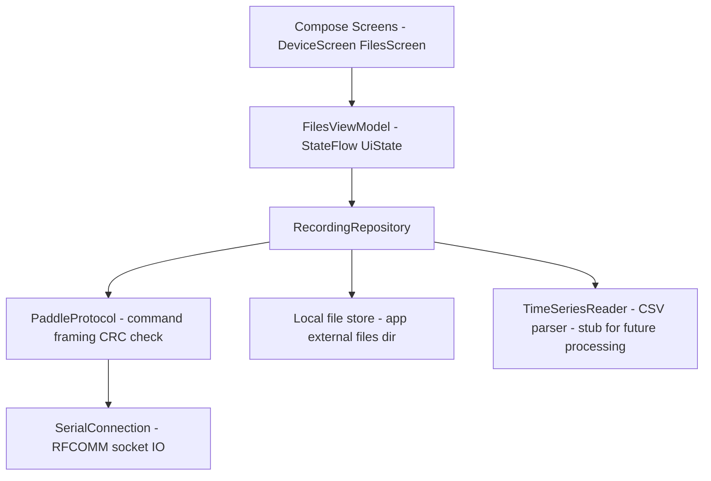

# Paddle Meter — System Architecture

Data-logger + wireless file-transfer system: an ESP32 samples an MPU-6050 at high rate, records
time series to an SD card, and serves the recorded files over Bluetooth Classic (SPP) to an
Android app that lists, downloads, verifies, and then deletes them on the device.

---

## 1. Hardware & Wiring

| Component | Interface | ESP32 Pin | Notes |
|---|---|---|---|
| MPU-6050 | I2C SDA | GPIO 21 | 400 kHz bus |
| MPU-6050 | I2C SCL | GPIO 22 | |
| MPU-6050 | VCC | 3V3 | module must be 3.3 V compatible |
| MPU-6050 | AD0 | GND | I2C address 0x68 |
| SD card reader | SPI CS | GPIO 5 | |
| SD card reader | SPI SCK | GPIO 18 | VSPI |
| SD card reader | SPI MOSI | GPIO 23 | |
| SD card reader | SPI MISO | GPIO 19 | |
| SD card reader | VCC | 5V (or 3V3) | typical modules have onboard LDO + level shifter |
| Status LED | GPIO 2 | onboard LED | solid = recording, slow blink = idle, fast blink = error |

SD card must be FAT32 formatted. The MPU-6050 has no magnetometer, so the firmware records raw
motion data (acceleration + angular rate); orientation/processing is done later on the phone.

---

## 2. ESP32 Firmware Architecture

PlatformIO project (`firmware/`), Arduino framework, FreeRTOS tasks.

### 2.1 Module overview



### 2.2 FreeRTOS tasks

| Task | Core | Priority | Period | Responsibility |
|---|---|---|---|---|
| `sensorTask` | 1 | 5 | `1000 / rate` ms (`vTaskDelayUntil`) | Burst-read 14 bytes from MPU-6050, convert to SI units, push `Sample` into ring buffer, count overflows |
| `storageTask` | 1 | 3 | continuous | Drain ring buffer into a 4 KB text buffer, write to SD every ≥ 2 KB or 250 ms, `flush()` every 1 s, close + fsync on STOP |
| `btTask` | 0 | 2 | continuous | Read SPP bytes, assemble lines, dispatch commands, stream files |
| `loopTask` (Arduino) | 1 | 1 | 100 ms | LED status pattern, watchdog-ish health reporting over USB serial |

The Bluetooth stack runs on core 0; sensor + storage are pinned to core 1 so sampling jitter
stays minimal. Practical sampling limit with `vTaskDelayUntil` is ~500 Hz (1 ms tick); default
rate is **200 Hz**, configurable 50–1000 Hz.

### 2.3 Data path

```cpp
struct Sample {            // 24 bytes
    uint32_t tUs;          // microseconds since boot (wraps after ~71 min)
    float ax, ay, az;      // m/s^2
    float gx, gy, gz;      // deg/s
};
```

- **SPSC ring buffer** (1024 samples ≈ 24 KB): producer = sensorTask, consumer = storageTask,
  `std::atomic` head/tail, lock-free, no allocation in the hot path.
- Overflow policy: if the buffer is full (SD stall), the oldest sample is dropped and a
  `dropped` counter is incremented; the counter is reported in `STATUS` and written into the
  file footer so the phone knows the data is gapped.
- MPU-6050 configuration: DLPF 44 Hz, accel ±4 g, gyro ±500 dps (constants in `config.h`).

### 2.4 File format & naming

- Directory `/data`, files `pm_0001.csv`, `pm_0002.csv`, … index persisted in NVS
  (`Preferences`), survives reboots.
- Header lines:
  ```
  # paddle-meter v1 rate=200 arange=4g grange=500dps
  t_us,ax,ay,az,gx,gy,gz
  ```
- Data lines: `1234567,0.1234,-9.8012,0.4321,1.20,-0.50,3.10`
- Footer on STOP: `# samples=41230 dropped=0`

### 2.5 Bluetooth service (SPP / RFCOMM)

`BluetoothSerial`, well-known SPP UUID `00001101-0000-1000-8000-00805F9B34FB`, device name
`paddle-meter`. Line-based ASCII protocol, `\n` terminated. RFCOMM provides reliability and
flow control, so file streaming relies on blocking writes (no per-chunk ACK needed); integrity
is verified end-to-end with CRC-32 (poly `0xEDB88320`, identical to `java.util.zip.CRC32`).

| Phone sends | ESP replies | Behavior |
|---|---|---|
| `PING` | `PONG` | liveness check |
| `STATUS` | `STATUS recording=0 rate=200 files=3 free_kb=2713600 dropped=0 version=1` | current state |
| `LIST` | `FILES 3` then 3× `FILE pm_0001.csv 48210` then `OK` | name + size in bytes |
| `GET pm_0001.csv` | `BEGIN 48210` → **48210 raw bytes** → `END 1A2B3C4D` | binary stream; on error before data: `ERR msg` |
| `DEL pm_0001.csv` | `DELETED` or `ERR msg` | phone deletes only after verified download |
| `START` | `STARTED` or `ERR msg` | begin recording session (opens new file) |
| `STOP` | `STOPPED` | close file, write footer |
| `RATE 500` | `RATE 500` | clamp 50–1000, applies to next START |
| anything else | `ERR unknown_command` | |

Download sequence:



### 2.6 Error handling

- SD init failure → fast-blink LED, `START`/`LIST` answer `ERR sd_not_ready`.
- BT disconnect during recording → recording continues; during transfer → transfer aborted,
  file stays on SD (deletion only ever happens after phone-verified transfer).
- Ring-buffer overflow → counted, reported, never blocks sampling.

---

## 3. Android App Architecture

Kotlin, Jetpack Compose (Material 3), MVVM, coroutines + StateFlow.
`minSdk 26`, `compileSdk/targetSdk 34`. Package `com.paddlemeter.app`.

### 3.1 Layers



### 3.2 Components

| Component | File | Responsibility |
|---|---|---|
| `SerialConnection` | `bluetooth/SerialConnection.kt` | Connect `BluetoothSocket` (SPP UUID), wrapped streams, `readLine()`, `readFully(n)`, `writeLine()`; all I/O on `Dispatchers.IO` |
| `PaddleProtocol` | `bluetooth/PaddleProtocol.kt` | Implements the command table above; `list()`, `status()`, `start()`, `stop()`, `rate(hz)`, `delete(name)`, `download(name, out, onProgress)` with CRC-32 verification |
| `RecordingRepository` | `data/RecordingRepository.kt` | Connection lifecycle, maps protocol results to UI models, saves downloads to `getExternalFilesDir(DIRECTORY_DOCUMENTS)/paddlemeter`, triggers auto-delete after verified transfer |
| `FilesViewModel` | `viewmodel/FilesViewModel.kt` | `UiState` (connection, status, file list, per-file transfer progress), user intents |
| `DeviceScreen` / `FilesScreen` | `ui/` | Paired-device picker; file list with size, download button + `LinearProgressIndicator`, delete button, refresh, START/STOP, rate dialog |
| `TimeSeriesReader` | `data/timeseries/TimeSeriesReader.kt` | Parses downloaded CSV into `List<TimeSeriesSample>` — clean extension point for the later processing feature |

### 3.3 Permissions

- API 31+: runtime `BLUETOOTH_CONNECT`
- API ≤ 30: `BLUETOOTH`, `BLUETOOTH_ADMIN` (maxSdk 30) + runtime `ACCESS_FINE_LOCATION`
  (required for BT discovery on old APIs)
- No storage permission needed: downloads go to the app-specific external files dir
  (visible via USB/Files app, no MediaStore hassle).

### 3.4 Concurrency model

- One command at a time over the RFCOMM stream (request/response, serialized in the
  repository) — no background reader thread needed because the ESP32 never sends
  unsolicited data.
- Transfer progress reported via callback → `StateFlow` → Compose recomposition.
- Auto-delete is default-on (per requirement: delete after successful transfer); a per-file
  toggle can disable it.

---

## 4. Project Layout

```
paddle-meter/
├── firmware/                          # PlatformIO project
│   ├── platformio.ini
│   ├── include/config.h               # pins, rates, protocol constants
│   └── src/
│       ├── main.cpp                   # setup, task creation, LED
│       ├── Sample.h                   # Sample struct + ring buffer
│       ├── sensor_task.h/.cpp         # MPU-6050 sampling
│       ├── storage_task.h/.cpp        # SD writer, file naming, NVS index
│       ├── bt_service.h/.cpp          # SPP command protocol + CRC32
│       └── recorder.h/.cpp            # shared state machine
├── android/                           # Android Studio project
│   ├── settings.gradle.kts
│   ├── build.gradle.kts
│   └── app/
│       ├── build.gradle.kts
│       └── src/main/
│           ├── AndroidManifest.xml
│           ├── res/values/{strings,themes}.xml
│           └── java/com/paddlemeter/app/
│               ├── MainActivity.kt
│               ├── bluetooth/SerialConnection.kt
│               ├── bluetooth/PaddleProtocol.kt
│               ├── data/RecordingRepository.kt
│               ├── data/model/Models.kt
│               ├── data/timeseries/TimeSeriesReader.kt
│               ├── viewmodel/FilesViewModel.kt
│               └── ui/{theme,DeviceScreen,FilesScreen}.kt
├── docs/architecture.md               # copy of this document
└── README.md                          # wiring, build, usage
```

---

## 5. Build & Run

**Firmware**: open `firmware/` in VS Code + PlatformIO → `Upload` → pair `paddle-meter` in
Android Bluetooth settings.

**App**: open `android/` in Android Studio → Run on device → grant Bluetooth permission →
connect → list/download/delete recordings.

---

## 6. Key Decisions & Risks

| Decision | Rationale |
|---|---|
| Bluetooth Classic SPP, not BLE | ~10–50 KB/s vs ~1 KB/s; RFCOMM is reliable + flow-controlled; ESP32-WROOM-32 supports Classic |
| CSV on SD | human-readable, trivially parseable later, robust; 200 Hz ≈ 10 KB/s write load is trivial for SD |
| CRC-32 end-to-end | integrity without per-chunk ACK overhead; matches `java.util.zip.CRC32` |
| Delete driven by phone | deletion happens only after verified transfer — no data loss on flaky links |
| Lock-free SPSC buffer | sampling never blocks on SD latency spikes |
| App-specific external dir | no storage permission, files still user-accessible |

Risks: RFCOMM throughput makes multi-MB transfers take minutes (acceptable for post-session
download); MPU-6050 yaw drifts (no magnetometer) — irrelevant for raw-data logging; FAT32
4 GB file limit ≈ >8 h at 200 Hz.
