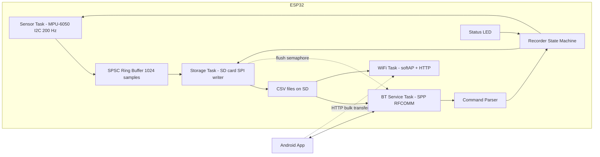
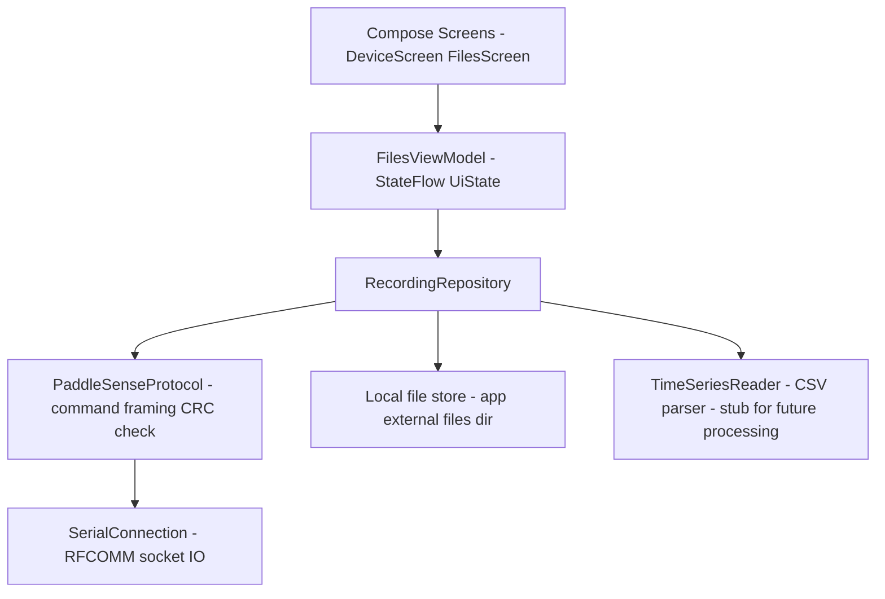

# PaddleSense — System Architecture

> The wire protocol, recording file format, and CRC-32 spec are defined in
> [`protocol.md`](protocol.md) — the contract shared by the firmware and the app.

Data-logger + wireless file-transfer system: an ESP32 samples an MPU-6050 at high rate, records
time series to an SD card, and serves the recorded files over Bluetooth Classic (SPP) to an
Android app that lists, downloads, verifies, and then deletes them on the device.

---

## 1. Hardware & Wiring

| Component | Interface | ESP32 Pin | Notes |
|---|---|---|---|
| MPU-6050 | I2C SDA | GPIO 21 | 400 kHz bus |
| MPU-6050 | I2C SCL | GPIO 22 | |
| MPU-6050 | VCC | 3V3 | module must be 3.3 V compatible |
| MPU-6050 | AD0 | GND | I2C address 0x68 |
| SD card reader | SPI CS | GPIO 5 | |
| SD card reader | SPI SCK | GPIO 18 | VSPI |
| SD card reader | SPI MOSI | GPIO 23 | |
| SD card reader | SPI MISO | GPIO 19 | |
| SD card reader | VCC | 5V (or 3V3) | typical modules have onboard LDO + level shifter |
| Status LED | GPIO 2 | onboard LED | solid = recording, slow blink = idle, fast blink = error |

SD card must be FAT32 formatted. The MPU-6050 has no magnetometer, so the firmware records raw
motion data (acceleration + angular rate); orientation/processing is done later on the phone.

---

## 2. ESP32 Firmware Architecture

PlatformIO project (`firmware/`), Arduino framework, FreeRTOS tasks.

### 2.1 Module overview



### 2.2 FreeRTOS tasks

| Task | Core | Priority | Period | Responsibility |
|---|---|---|---|---|
| `sensorTask` | 1 | 5 | `1000 / rate` ms (`vTaskDelayUntil`) | Burst-read 14 bytes from MPU-6050, convert to SI units, push `Sample` into ring buffer, count overflows |
| `storageTask` | 1 | 3 | continuous | Drain ring buffer into a 32 KB text buffer, write to SD when it holds ≥ 24 KB **or** every 2 s (whichever first), `flush()` after each write, close + fsync on STOP. Publishes a flush semaphore for live tail. Thresholds are runtime-tunable via `/config.txt` |
| `btTask` | 0 | 2 | continuous | Read SPP bytes, assemble lines, dispatch commands, stream files, live-tail the open recording |
| `wifiTask` | 0 | 2 | continuous | Service HTTP requests while the softAP is up (idle otherwise) |
| `loopTask` (Arduino) | 1 | 1 | 100 ms | LED status pattern, watchdog-ish health reporting over USB serial |

The Bluetooth stack runs on core 0; sensor + storage are pinned to core 1 so sampling jitter
stays minimal. Practical sampling limit with `vTaskDelayUntil` is ~500 Hz (1 ms tick); default
rate is **200 Hz**, configurable 50–1000 Hz.

### 2.3 Data path

```cpp
struct Sample {            // 24 bytes
    uint32_t tUs;          // microseconds since boot (wraps after ~71 min)
    float ax, ay, az;      // m/s^2
    float gx, gy, gz;      // deg/s
};
```

- **SPSC ring buffer** (1024 samples ≈ 24 KB): producer = sensorTask, consumer = storageTask,
  `std::atomic` head/tail, lock-free, no allocation in the hot path.
- Overflow policy: if the buffer is full (SD stall), the oldest sample is dropped and a
  `dropped` counter is incremented; the counter is reported in `STATUS` and written into the
  file footer so the phone knows the data is gapped.
- MPU-6050 configuration: DLPF 44 Hz, accel ±4 g, gyro ±500 dps (constants in `config.h`).

### 2.4 Storage write cadence & runtime configuration

Samples are never written to the card one at a time. The storage task formats each sample into a
CSV line and appends it to a static 32 KB RAM buffer; the buffer is written to the card when it
reaches a **size threshold** *or* a **time interval** elapses, whichever comes first. A separate
`flush()` (fsync) cadence bounds how much data is lost if power is cut mid-session.

| Setting | Default | Range | Meaning |
|---|---|---|---|
| `write_threshold` | 24576 (24 KB) | 512 – 32768 | write the buffer once it holds this many bytes |
| `write_interval_ms` | 2000 | 100 – 60000 | ...or once this long has elapsed since the last write |
| `flush_interval_ms` | 2000 | 100 – 60000 | fsync cadence (data-loss window on power loss) |
| `wifi_ssid` | `paddlesense` | ≤ 32 chars | WiFi softAP SSID for transfer mode |
| `wifi_pass` | `paddlesense` | 8 – 64 chars | WiFi softAP password (WPA2) |
| `bt_name` | `paddlesense` | ≤ 32 chars | Bluetooth Classic SPP device name |

At the default 200 Hz (~12 KB/s of text) the size threshold and the 2 s interval coincide, giving
roughly one card write every 2 s. At 1000 Hz (~60 KB/s) the size threshold dominates and the
buffer is written every ~0.4 s. Either way the number of SPI transactions stays moderate.

These values can be overridden at boot by a plain-text `/config.txt` on the SD card:

```
# /config.txt — optional; missing keys keep their compiled-in default
write_threshold=24576
write_interval_ms=2000
flush_interval_ms=2000
wifi_ssid=paddlesense
wifi_pass=paddlesense
bt_name=paddlesense
```

The file is parsed once in `storageInit()` after the card is mounted. Blank lines and lines
starting with `#` or `;` are ignored; unknown keys and out-of-range values are logged and
discarded, so a malformed file can never prevent a recording. The effective values are printed
on the USB serial console at boot.

### 2.5 File format & naming

- Directory `/data`, files `ps_0001.csv`, `ps_0002.csv`, … index persisted in NVS
  (`Preferences`), survives reboots.
- Header lines:
  ```
  # paddlesense v1 rate=200 arange=4g grange=500dps
  t_us,ax,ay,az,gx,gy,gz
  ```
- Data lines: `1234567,0.1234,-9.8012,0.4321,1.20,-0.50,3.10`
- Footer on STOP: `# samples=41230 dropped=0`

### 2.6 Bluetooth service (SPP / RFCOMM)

`BluetoothSerial`, well-known SPP UUID `00001101-0000-1000-8000-00805F9B34FB`, device name
`paddlesense`. Line-based ASCII protocol, `\n` terminated. RFCOMM provides reliability and
flow control, so file streaming relies on blocking writes (no per-chunk ACK needed); integrity
is verified end-to-end with CRC-32 (poly `0xEDB88320`, identical to `java.util.zip.CRC32`).

The full command table, `TAIL`/`MODE` framing, and the WiFi HTTP endpoints are defined in
[`protocol.md`](protocol.md) §2. Summary of the v2 additions:

| Phone sends | ESP replies | Behavior |
|---|---|---|
| `TAIL ps_0005.csv` | `BEGIN ?` → repeated `DATA <n>` + n bytes → `END <crc32>` | live stream of the open recording |
| `ENDTAIL` | `END ABORT` | stop tailing, keep recording |
| `MODE wifi` | `MODE wifi ssid=… ip=…` | bring up softAP + HTTP |
| `MODE legacy` | `MODE legacy` | tear WiFi down |
| `START` | `STARTED ps_0005.csv` | begin session (now names the file) |

Download sequence (static `GET`):


### 2.6.1 Live tail (v2)

`TAIL <name>` streams the currently open recording while it is still being
written. The storage task publishes a binary semaphore after every write+fsync
round; the BT task waits on it and forwards any newly written bytes as
`DATA <n>` chunks. `STOP` during a tail closes the file, streams the remainder,
sends `END <crc32>`, then `STOPPED`. This hides the end-of-session download
latency entirely: when the user stops, the phone already holds the data.

### 2.6.2 WiFi transfer (v2)

`MODE wifi` brings up a softAP (`paddlesense`) and a small `WebServer` serving
`GET /files`, `GET /files/<name>` and `GET /status`. The phone downloads over
HTTP at ~100× the SPP throughput while Bluetooth stays connected for control
and deletion. Because BT Classic and WiFi share one 2.4 GHz radio, the app
treats the modes as mutually exclusive: WiFi for bulk transfer, BT for control
and live tail.

### 2.7 Error handling

- SD init failure → fast-blink LED, `START`/`LIST` answer `ERR sd_not_ready`.
- BT disconnect during recording → recording continues; during transfer → transfer aborted,
  file stays on SD (deletion only ever happens after phone-verified transfer).
- Ring-buffer overflow → counted, reported, never blocks sampling.

---

## 3. Android App Architecture

Kotlin, Jetpack Compose (Material 3), MVVM, coroutines + StateFlow.
`minSdk 26`, `compileSdk/targetSdk 34`. Package `com.paddlesense.app`.

### 3.1 Layers



### 3.2 Components

| Component | File | Responsibility |
|---|---|---|
| `SerialConnection` | `bluetooth/SerialConnection.kt` | Connect `BluetoothSocket` (SPP UUID), wrapped streams, `readLine()`, `readFully(n)`, `writeLine()`; all I/O on `Dispatchers.IO` |
| `PaddleSenseProtocol` | `bluetooth/PaddleSenseProtocol.kt` | Implements the command table above; `list()`, `status()`, `start()`, `stop()`, `rate(hz)`, `delete(name)`, `download(name, out, onProgress)` with CRC-32 verification |
| `RecordingRepository` | `data/RecordingRepository.kt` | Connection lifecycle, maps protocol results to UI models, saves downloads to `getExternalFilesDir(DIRECTORY_DOCUMENTS)/paddlesense`, triggers auto-delete after verified transfer |
| `FilesViewModel` | `viewmodel/FilesViewModel.kt` | `UiState` (connection, status, file list, per-file transfer progress), user intents |
| `DeviceScreen` / `FilesScreen` | `ui/` | Paired-device picker; file list with size, download button + `LinearProgressIndicator`, delete button, refresh, START/STOP, rate dialog |
| `TimeSeriesReader` | `data/timeseries/TimeSeriesReader.kt` | Parses downloaded CSV into `List<TimeSeriesSample>` — clean extension point for the later processing feature |

### 3.3 Permissions

- API 31+: runtime `BLUETOOTH_CONNECT`
- API ≤ 30: `BLUETOOTH`, `BLUETOOTH_ADMIN` (maxSdk 30) + runtime `ACCESS_FINE_LOCATION`
  (required for BT discovery on old APIs)
- No storage permission needed: downloads go to the app-specific external files dir
  (visible via USB/Files app, no MediaStore hassle).

### 3.4 Concurrency model

- One command at a time over the RFCOMM stream (request/response, serialized in the
  repository) — no background reader thread needed because the ESP32 never sends
  unsolicited data.
- Transfer progress reported via callback → `StateFlow` → Compose recomposition.
- Auto-delete is default-on (per requirement: delete after successful transfer); a per-file
  toggle can disable it.

---

## 4. Project Layout

```
paddlesense/
├── firmware/                          # PlatformIO project
│   ├── platformio.ini
│   ├── include/config.h               # pins, rates, protocol constants
│   └── src/
│       ├── main.cpp                   # setup, task creation, LED
│       ├── Sample.h                   # Sample struct + ring buffer
│       ├── sensor_task.h/.cpp         # MPU-6050 sampling
│       ├── storage_task.h/.cpp        # SD writer, file naming, NVS index
│       ├── settings.h/.cpp            # /config.txt parser + runtime settings
│       ├── bt_service.h/.cpp          # SPP command protocol + CRC32 + live tail
│       ├── wifi_service.h/.cpp        # softAP + HTTP file server (v2)
│       └── recorder.h/.cpp            # shared state machine
├── android/                           # Android Studio project
│   ├── settings.gradle.kts
│   ├── build.gradle.kts
│   └── app/
│       ├── build.gradle.kts
│       └── src/main/
│           ├── AndroidManifest.xml
│           ├── res/values/{strings,themes}.xml
│           └── java/com/paddlesense/app/
│               ├── MainActivity.kt
│               ├── bluetooth/SerialConnection.kt
│               ├── bluetooth/PaddleSenseProtocol.kt
│               ├── data/RecordingRepository.kt
│               ├── data/model/Models.kt
│               ├── data/timeseries/TimeSeriesReader.kt
│               ├── viewmodel/FilesViewModel.kt
│               └── ui/{theme,DeviceScreen,FilesScreen}.kt
├── docs/architecture.md               # copy of this document
└── README.md                          # wiring, build, usage
```

---

## 5. Build & Run

**Firmware**: open `firmware/` in VS Code + PlatformIO → `Upload` → pair `paddlesense` in
Android Bluetooth settings.

**App**: open `android/` in Android Studio → Run on device → grant Bluetooth permission →
connect → list/download/delete recordings.

---

## 6. Key Decisions & Risks

| Decision | Rationale |
|---|---|
| Bluetooth Classic SPP, not BLE | ~10–50 KB/s vs ~1 KB/s; RFCOMM is reliable + flow-controlled; ESP32-WROOM-32 supports Classic |
| CSV on SD | human-readable, trivially parseable later, robust; 200 Hz ≈ 10 KB/s write load is trivial for SD |
| CRC-32 end-to-end | integrity without per-chunk ACK overhead; matches `java.util.zip.CRC32` |
| Delete driven by phone | deletion happens only after verified transfer — no data loss on flaky links |
| Lock-free SPSC buffer | sampling never blocks on SD latency spikes |
| Buffered, time/size-triggered SD writes | avoids one SPI transaction per sample; keeps write count moderate at any rate |
| `/config.txt` on SD for tuning | user-editable without reflashing; defaults + clamping mean a bad file can't break recording |
| App-specific external dir | no storage permission, files still user-accessible |
| Live tail over BT (v2) | hides end-of-session download latency; reuses the existing SPP link and CRC-32 verification |
| WiFi softAP + HTTP for bulk transfer (v2) | ~100× SPP throughput; no router needed; BT kept for control |
| Modes mutually exclusive (v2) | BT Classic and WiFi share one 2.4 GHz radio — never stream both at full speed |
| `huge_app.csv` partition (v2) | WiFi stack + HTTP server grow the image past the default app partition |

Risks: RFCOMM throughput makes multi-MB transfers take minutes over BT (mitigated by the WiFi
transfer mode); BT throughput drops while WiFi is up (mitigated by mutually exclusive modes);
MPU-6050 yaw drifts (no magnetometer) — irrelevant for raw-data logging; FAT32 4 GB file limit
≈ >8 h at 200 Hz.
