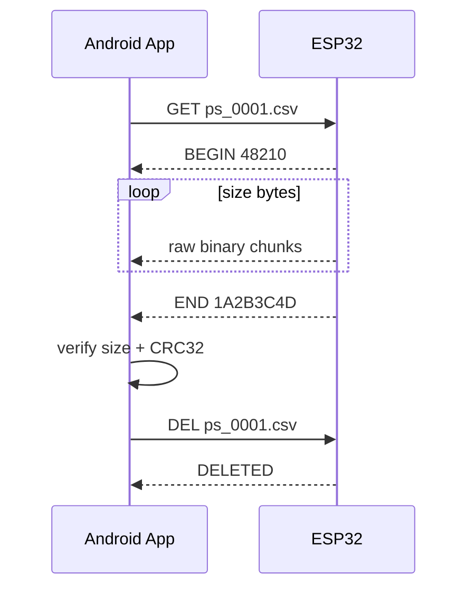
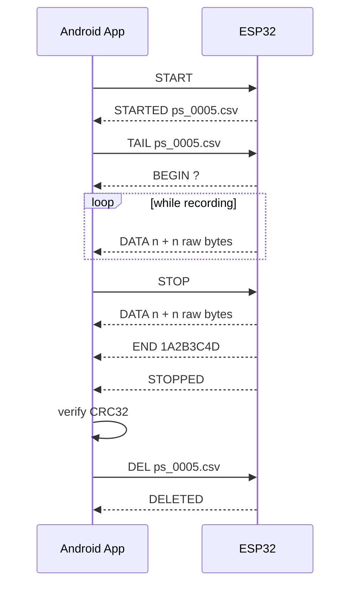
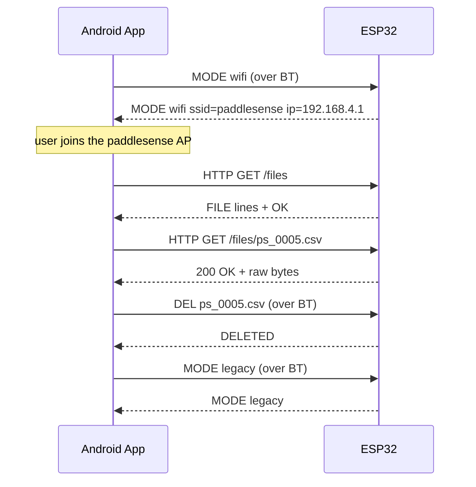

# PaddleSense — Wire Protocol & File Format

This document is the **contract** between the ESP32 firmware and the Android app.
It is the single source of truth for the Bluetooth SPP command protocol, the
on-card recording format, and the integrity check. If the firmware and app ever
live in separate repositories, both link back to this file.

- Transport: **Bluetooth Classic SPP (RFCOMM)** for control + legacy transfer;
  optional **WiFi softAP + HTTP** for fast bulk transfer (v2)
- Encoding: **line-based ASCII**, `\n` terminated (commands and replies)
- File payloads: **raw binary** streamed between `BEGIN` and `END` (or framed
  as `DATA <n>` chunks for live tail)
- Integrity: **CRC-32** (zlib polynomial `0xEDB88320`, identical to
  `java.util.zip.CRC32`)

---

## 1. Transport

| Property | Value |
|---|---|
| Profile | Bluetooth Classic SPP / RFCOMM |
| SPP UUID | `00001101-0000-1000-8000-00805F9B34FB` |
| Device name | `paddlesense` (overridable via `/config.txt` key `bt_name`) |
| Line terminator | `\n` (LF) |
| Max command line | 128 bytes (`PROTO_LINE_MAX`) |
| TX chunk size | 4096 bytes (`PROTO_TX_CHUNK`) |
| WiFi AP SSID | `paddlesense` (overridable via `/config.txt`) |
| WiFi AP password | `paddlesense` (WPA2, ≥ 8 chars) |
| WiFi HTTP port | 80 |

RFCOMM provides reliability and flow control, so file streaming uses blocking
writes with no per-chunk ACK. Integrity is verified end-to-end with CRC-32.

The ESP32 never sends unsolicited data: every reply is a response to a command,
so the client can serialize one command at a time (request/response).

---

## 2. Command reference

| Phone sends | ESP replies | Behavior |
|---|---|---|
| `PING` | `PONG` | liveness check |
| `STATUS` | `STATUS recording=0 rate=200 files=3 free_kb=2713600 dropped=0 version=2 wifi=0 ip=- ssid=-` | current state |
| `LIST` | `FILES 3` then 3× `FILE ps_0001.csv 48210` then `OK` | name + size in bytes |
| `GET ps_0001.csv` | `BEGIN 48210` → **48210 raw bytes** → `END 1A2B3C4D` | binary stream; on error before data: `ERR msg` |
| `TAIL ps_0005.csv` | `BEGIN ?` → repeated `DATA <n>` + n bytes → `END <crc32>` | live stream of the open recording (v2) |
| `ENDTAIL` | (tail aborts) `END ABORT` | stop tailing, keep recording (v2) |
| `MODE wifi` | `MODE wifi ssid=paddlesense ip=192.168.4.1` or `ERR wifi_failed` | bring up softAP + HTTP (v2) |
| `MODE legacy` | `MODE legacy` | tear WiFi down (v2) |
| `MODE` | `MODE legacy` / `MODE wifi ssid=… ip=…` | query current mode (v2) |
| `DEL ps_0001.csv` | `DELETED` or `ERR msg` | phone deletes only after verified download |
| `START` | `STARTED ps_0005.csv` or `ERR msg` | begin recording session (opens new file) |
| `STOP` | `STOPPED` | close file, write footer |
| `RATE 500` | `RATE 500` | clamp 50–1000, applies to next `START` |
| anything else | `ERR unknown_command` | |

### 2.1 `STATUS` fields

| Field | Meaning |
|---|---|
| `recording` | `1` while a session is active, else `0` |
| `rate` | current sample rate in Hz |
| `files` | number of recordings on the card |
| `free_kb` | free space on the SD card, in KB |
| `dropped` | cumulative dropped-sample count for the current/last session |
| `version` | firmware protocol version (`FW_VERSION`) |
| `wifi` | `1` while the softAP is up, else `0` (v2) |
| `ip` | AP IP address, or `-` when down (v2) |
| `ssid` | AP SSID, or `-` when down (v2) |

The `wifi`/`ip`/`ssid` fields are appended, so a v1 client that parses the
leading key=value pairs keeps working.

### 2.2 `LIST` framing

```
FILES 3
FILE ps_0001.csv 48210
FILE ps_0002.csv 12044
FILE ps_0003.csv 900
OK
```

The first line gives the count; exactly that many `FILE` lines follow, then a
terminating `OK`. Each `FILE` line is `<name> <size_bytes>`.

### 2.3 `GET` framing

```
BEGIN 48210
<48210 raw bytes, no framing, no escaping>
END 1A2B3C4D
```

- `BEGIN <size>` announces the exact byte count that follows.
- The client reads exactly `<size>` bytes verbatim.
- `END <crc32>` carries the CRC-32 of the payload as 8 uppercase hex digits.
- If the file cannot be opened, the ESP replies `ERR <reason>` **before** any
  data bytes.

### 2.4 `RATE`

`RATE <hz>` clamps the requested value to the range **50–1000 Hz** and echoes the
applied value. The new rate takes effect on the next `START`.

### 2.5 `TAIL` (live stream, v2)

`TAIL <name>` streams the **currently open** recording file while it is still
being written, so the phone can receive data during the session and has nothing
left to download at `STOP`.

```
BEGIN ?
DATA 4096
<4096 raw bytes>
DATA 4096
<4096 raw bytes>
...
END 1A2B3C4D
```

- `BEGIN ?` — the total size is unknown while recording (unlike `GET`).
- Each `DATA <n>` line is followed by exactly `<n>` raw bytes. The `DATA` line
  makes the binary payload unambiguous even though the size is not known up
  front.
- `END <crc32>` carries the CRC-32 of **all** payload bytes, identical to `GET`.
- If `<name>` is not the currently open file, `TAIL` behaves exactly like `GET`
  (a static download).
- While tailing, the ESP processes **only** `STOP` and `ENDTAIL` from the phone;
  any other command line is ignored (a reply would corrupt the binary stream).
- `STOP` during a tail: the ESP stops recording, drains and closes the file,
  streams the remaining bytes, sends `END <crc32>`, and **then** sends
  `STOPPED` — so the reply order on the wire is `END` then `STOPPED`.
- `ENDTAIL` aborts the tail but keeps recording; the ESP replies `END ABORT`.
- If the phone disconnects mid-tail, the tail aborts and the file stays on SD
  (recoverable with a normal `GET`).

### 2.6 `MODE` (transfer mode, v2)

`MODE wifi` brings up the ESP32 softAP and HTTP server; `MODE legacy` tears it
down. `MODE` with no argument queries the current mode.

```
MODE wifi    ->  MODE wifi ssid=paddlesense ip=192.168.4.1
MODE legacy  ->  MODE legacy
MODE         ->  MODE legacy
```

Bluetooth Classic and WiFi share the same 2.4 GHz radio, so WiFi and BT
streaming must not run at full speed simultaneously. The app modes enforce this:
use WiFi for bulk transfer, BT for control and live tail.

### 2.7 WiFi HTTP endpoints (v2)

While `MODE wifi` is active, the ESP serves plain HTTP on port 80:

| Method + path | Response |
|---|---|
| `GET /files` | `FILE <name> <size>\n` per recording, then `OK\n` |
| `GET /files/<name>` | `200 OK`, `Content-Length`, raw bytes |
| `GET /status` | JSON: `recording`, `rate`, `files`, `free_kb`, `dropped`, `version`, `ssid`, `ip` |

Deletion still happens over Bluetooth (`DEL`) after the phone verifies the
downloaded file, so the "delete only after verified transfer" guarantee holds
for WiFi transfers too.

### 2.8 Errors

All errors are a single line: `ERR <reason>`. Known reasons include
`unknown_command`, `sd_not_ready`, `bad_name`, `bad_mode`, `wifi_failed`, and
file-open failures.

---

## 3. Download sequences

### 3.1 Static download (`GET`)



### 3.2 Live tail (`TAIL`)



### 3.3 WiFi transfer (`MODE wifi`)



Deletion is **phone-driven** in all three flows: the app only sends `DEL` after
the transfer has been verified (size + CRC-32). A dropped link therefore never
loses data — the file stays on the card until a verified transfer completes.

---

## 4. Recording file format

### 4.1 Naming

- Directory: `/data`
- Files: `ps_0001.csv`, `ps_0002.csv`, … (`FILE_PREFIX` = `ps_`)
- The index is persisted in NVS (`Preferences`, namespace `paddlesense`) and
  survives reboots.

### 4.2 Structure

```
# paddlesense v1 rate=200 arange=4g grange=500dps
t_us,ax,ay,az,gx,gy,gz
1234567,0.1234,-9.8012,0.4321,1.20,-0.50,3.10
...
# samples=41230 dropped=0
```

| Line | Content |
|---|---|
| Header comment | `# paddlesense v<version> rate=<hz> arange=<g>g grange=<dps>dps` |
| Column header | `t_us,ax,ay,az,gx,gy,gz` |
| Data rows | one sample per line, comma-separated |
| Footer comment | `# samples=<n> dropped=<n>` (written on `STOP`) |

### 4.3 Columns

| Column | Unit | Meaning |
|---|---|---|
| `t_us` | microseconds | time since boot (wraps after ~71 min) |
| `ax, ay, az` | m/s² | acceleration |
| `gx, gy, gz` | deg/s | angular rate |

The MPU-6050 has no magnetometer, so only raw acceleration and angular rate are
recorded; orientation/processing happens later on the phone.

### 4.4 Metadata semantics

- `rate` — sample rate in Hz (50–1000).
- `arange` — accelerometer full-scale in g (default 4).
- `grange` — gyroscope full-scale in deg/s (default 500).
- `dropped` — number of samples lost to ring-buffer overflow (SD stall). A
  non-zero value means the recording has gaps.

---

## 5. Integrity check (CRC-32)

- Polynomial: `0xEDB88320` (reflected, zlib/PNG variant).
- Initial value: `0xFFFFFFFF`; final XOR: `0xFFFFFFFF`.
- Computed over the **exact raw bytes** of the file payload (the bytes between
  `BEGIN` and `END`), not over any text transformation.
- Transmitted as 8 uppercase hex digits in the `END` line.
- The Android side uses `java.util.zip.CRC32`, which implements the same
  algorithm, so the values match byte-for-byte.

---

## 6. Versioning

`FW_VERSION` (currently `2`) is reported in `STATUS` and embedded in every file
header. Any change to the command set, framing, or file format must bump this
version and be reflected in this document, the firmware
([`firmware/include/config.h`](../firmware/include/config.h)), and the Android
client ([`PaddleSenseProtocol.kt`](../android/app/src/main/java/com/paddlesense/app/bluetooth/PaddleSenseProtocol.kt)).

Version history:

| Version | Changes |
|---|---|
| 1 | Initial protocol: PING/STATUS/LIST/GET/DEL/START/STOP/RATE |
| 2 | `TAIL` live stream, `MODE` + WiFi softAP/HTTP transfer, `STARTED <name>`, `STATUS` wifi/ip/ssid fields, TX chunk 1024 → 4096 |
